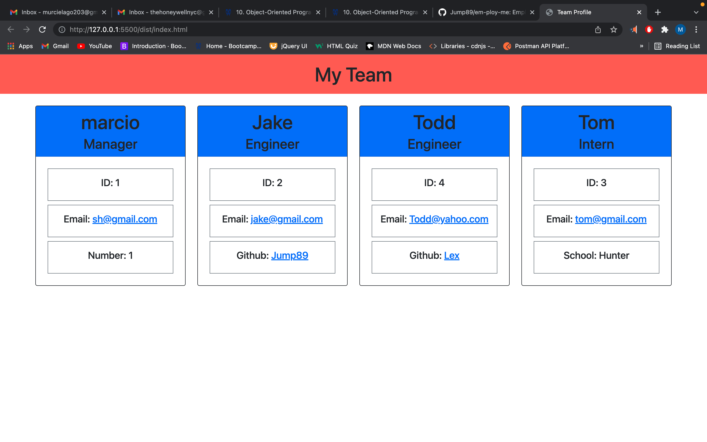

# em-ploy-me
Employee Tracker

## Description 

* This is a Node.js Command-Line Application, that takes in information about employees on a software engineering team and generates an HTML webpage that displays summaries for each person.

## User Story 

* AS A manager
I WANT to generate a webpage that displays my team's basic info
SO THAT I have quick access to their emails and GitHub profiles

## Features

* The ability to add multiple mangers, engineers, and interns.
* Creates cards with each team member 
* Creates unique id for each team member
* Creates links to github and email addresses 
* Creates an HTML webpage that features all entered employees

## Installation

* First in the terminal enter npm install
* Followed by node index.js
* Enter valid prompt data 
* Choice to enter additional employees 

## Dependencies

* No Dependencies for this Application

## License

* No Licenses for this Application 

## Credits 

* [Marcio Ramos]{https://github.com/Jump89}

## Resources 

* No Resources for this Application

## Front End

* HTML
* Bootstrap
* CSS
* JavaScript

## Backend

* [node.js](https://nodejs.org/en/)
* [Jest](https://jestjs.io/)
* [Inquirer](https://www.npmjs.com/package/inquirer)
 
## Repo

* (https://github.com/Jump89/em-ploy-me)

## Walk Through Video 

* (https://watch.screencastify.com/v/kI99RfNbJrevwII7w6te)

## Landing Page Screen Shoot

* 